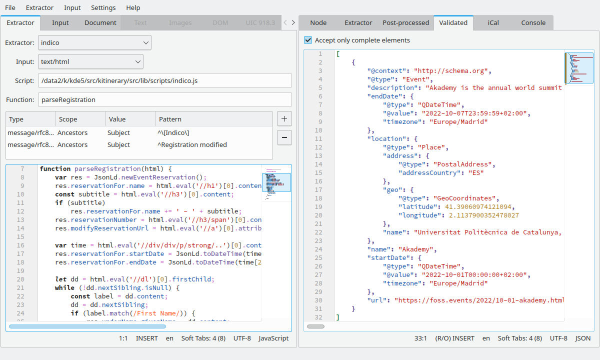

# KItinerary Workbench

Interactive test and inspection tool for developing extractor scripts for
the [Itinerary data extraction engine](https://invent.kde.org/pim/kitinerary).



## Installing

The easiest way to get KItinerary Workbench is from KDE's nightly Flatpak repository.

```
flatpak install https://cdn.kde.org/flatpak/kitinerary-workbench-nightly/org.kde.kitinerary-workbench.flatpakref
```

## Usage

KItinerary Workbench is structured into two main UI parts, the input panel on the left,
and the output panel on the right.

The input panel allows specifying the input data and its context, as well as inspecting
pre-processed input data (such as textual and image data extracted from a PDF). The output
panel allows to inspect the result of the various extractor and post-processing stages.

To test an extractor, specify the input data on the source tab of the input panel, either
by opening a file (via the file open dialog, or e.g. by dnd-ing an email attachment on to the
file input line), or by entering textual source data directly in the text field. If not detected
automatically, you also need to set the right input data type (plain text, HTML, PDF, Apple Wallet
passes, IATA boarding pass codes, UIC 918.3 train ticket codes, etc).

For structured data extractors this should already show results in the output panel then, for
unstructured data extractors you additionally need to specify the sender email (used to pick
the right extractor script) and optionally a context date (used to resolve date/time ambiguities).

## Extractor Development

For quick iterations during extractor script development, you can use the 'Reload' action to reload
and re-run the extractor on the already loaded input data. Any changes to the input data will trigger
this as well, so you can easily test certain variations in the input by editing the input text field.

For reloading to work, your extractor script must be placed in the file system rather than be compiled
in. It's therefore convenient to symlink the extractor sources to $XDG_DATA_DIRS/kitinerary/extractors
(see https://api.kde.org/kdepim/kitinerary/html/classKItinerary_1_1ScriptExtractor.html). Note that
reloading only works for extractor scripts, not for extractor meta data.

For PDF extractors, the input panel provides two additional tabs, one showing the extracted plain text
and one showing a list of images. For the image list, context menu action provide the ability to perform
Aztec of PDF417 barcode decoding. If successful the result of that is set as the new input text, and
selecting 'IATA BCBP' or 'UIC 918.3' as input will show the result of decoding the respective barcode
message.

For HTML extractors, the input panel provides an additional tab, showing the DOM tree of the parsed
document, and the attributes of an selected element in there.

The output view does not only show the final result ('Post-processed') but also the output of the
extractor script directly ('Extractor'), before it has been normalized, validated and
augmented in the post-processing stage (see https://api.kde.org/kdepim/kitinerary/html/classKItinerary_1_1ExtractorPostprocessor.html).

## Contributing

See the contributions section of the [Itinerary data extraction engine](https://invent.kde.org/pim/kitinerary)
README about contributing new or improved extractor scripts as well as about donating sample data.
